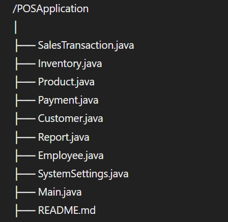

# POS Application Project

## Project Overview

This project is a Point of Sale (POS) application designed to manage sales transactions, inventory, products, payments, customers, reports, and employees. The application follows object-oriented principles to ensure a modular and maintainable codebase.

## Project Structure

The project consists of the following key components:

1. **SalesTransaction**: Manages sales transactions, calculates totals, applies discounts, and generates receipts.
2. **Inventory**: Tracks inventory, receives shipments, and updates stock levels.
3. **Product**: Represents products in the inventory, with attributes such as product ID, name, description, price, category, and stock level.
4. **Payment**: Processes payments, verifies payments, and generates payment receipts.
5. **Customer**: Manages customer information, purchase history, and loyalty points.
6. **Report**: Generates, exports, and displays reports based on sales data.
7. **Employee**: Tracks employee hours, manages permissions, and generates payroll information.
8. **SystemSettings**: Manages system settings, user preferences, and security settings.

## File Structure



## Getting Started

### Prerequisites

- Java Development Kit (JDK) 8 or higher

### Installation

1. Clone the repository:

   ```sh
   git clone https://github.com/your-username/POSApplication.git
   ```

2. Navigate to the project directory:

   ```sh
   cd POSApplication
   ```

### Compilation

Compile all Java files using the following command:

```sh
javac *.java
```

### Running the Application

- Run the Main class to start the application:

```sh
java Main
```

## Usage

- The Main class contains a sample implementation to demonstrate the basic functionality of the POS application.
- You can create, manage, and display products, sales transactions, customers, inventory, and more.

## Example

- Here is an example of how to create and use some of the classes:

```sh
public class Main {
    public static void main(String[] args) {
        // Create some products
        Product product1 = new Product("P001", "Apple", 0.50);
        Product product2 = new Product("P002", "Banana", 0.30);

        // Create a sales transaction
        SalesTransaction transaction = new SalesTransaction("T001", "2024-07-19");
        transaction.addItem(product1);
        transaction.addItem(product2);

        // Calculate total and generate receipt
        transaction.calculateTotal();
        System.out.println(transaction.generateReceipt());

        // Create a customer
        Customer customer = new Customer("C001", "John Doe");
        customer.addPurchaseHistory(transaction);

        // Create an inventory and add products
        Inventory inventory = new Inventory("I001");
        inventory.receiveShipment(product1);
        inventory.receiveShipment(product2);

        // Display product info
        product1.displayProductInfo();
        product2.displayProductInfo();
    }
}
```

## Contributing

- Fork the repository
- Create your feature branch (git checkout -b feature/your-feature)
- Commit your changes (git commit -m 'Add some feature')
- Push to the branch (git push origin feature/your-feature)
- Open a pull request

## License

- This project is licensed under the MIT License - see the LICENSE file for details.

## Acknowledgments

- Thanks to the open-source community for providing tools and inspiration.

```sh
This `README.md` provides an overview of the project, instructions for getting started, and an example of how to use the application. You can customize it further based on your specific requirements and project details.
```
